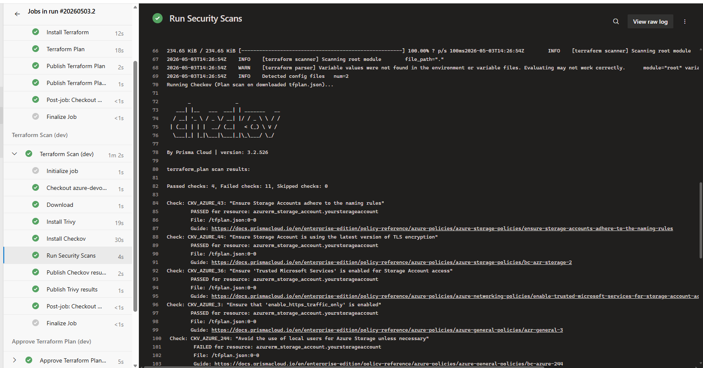
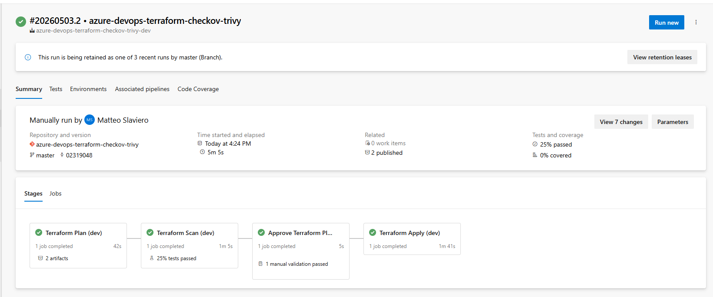
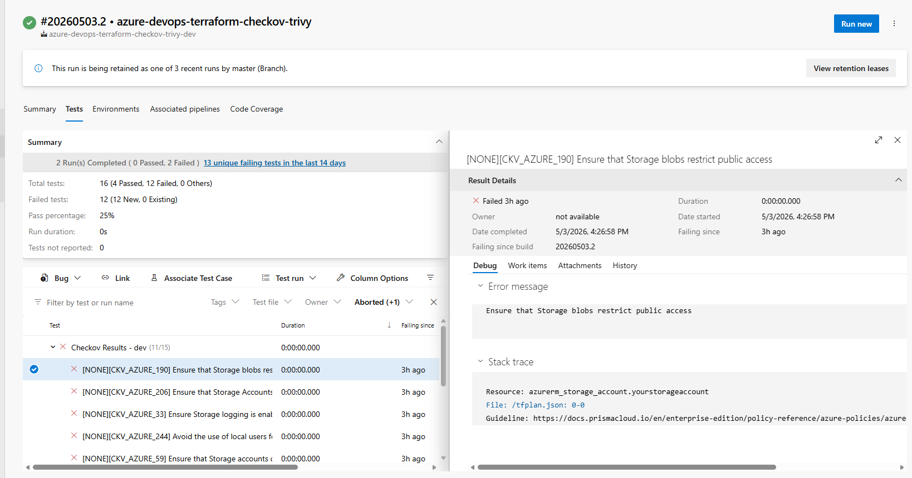

# Azure DevOps Terraform Security Pipeline

**Terraform · Checkov · Trivy · Azure DevOps**

## Overview

This repository provides a **reusable Azure DevOps pipeline template**
for deploying Terraform infrastructure with **security and governance
built in by design**.

It integrates **Terraform**, **Checkov**, and **Trivy** to enable
**policy-as-code validation** and **security scanning** throughout the
deployment lifecycle**.

In particular, it includes **post-plan analysis**, ensuring that *actual
infrastructure changes* are evaluated *before deployment (apply)*.

## Key Features

-   **Security-first approach**
    Security controls are embedded directly into every stage of the
    pipeline lifecycle.

-   **Post-plan scanning (real change validation)**
    Analyzes Terraform plan output rather than relying solely on static
    code checks.

-   **Environment reusability**
    A single pipeline template consistently supports **dev, test,** and
    **production** environments.

-   **Configurable quality gates**
    Pipeline execution can be automatically blocked based on defined
    **security and compliance thresholds**.

## Configuration

### Terraform Backend (`provider.tf`)

Configure the Terraform backend to store state in Azure Storage:

``` hcl
backend "azurerm" {
  resource_group_name  = "<your_resource_group_name_for_tfstate>"
  storage_account_name = "<your_storage_account_name_for_tfstate>"
  container_name       = "<your_container_name_for_tfstate>"
}
```

### Azure DevOps Service Connection

Each environment pipeline (dev/test/prod) must reference an Azure
service connection:

``` yaml
azureServiceConnection: "<your_service_connection_name>"
```

**Notes:** - The service connection should be configured using
**Workload Identity Federation** for improved security.

## Usage

-   **Azure Service Connection**
   In Azure DevOps, create a service connection using *Workload Identity Federation*, and grant the generated service principal the *Storage Blob Data Contributor* role on the Azure Storage account to use to manage the Terraform state.

-   **Azure DevOps Environments**
    Create an *Azure DevOps Environment* for each environment to manage
    (dev, test, and prod). Optionally,bconfigure the appropriate
    *Approvals and Checks* for each environment.

-   **Azure Pipelines**
    Create an *Azure DevOps Pipeline* for each environment using for example the
    `dev-pipeline.yml`, `test-pipeline.yml`, and `prod-pipeline.yml`
    files.

## Quality Gates 

The pipeline enforces **configurable quality gates** that can block
execution based on:

-   **Security findings**
    -   High or critical misconfigurations
-   **Policy violations**
    -   Non-compliant resource definitions

This ensures that only compliant and secure infrastructure changes are
deployed.

## Checkov & Trivy Customization

Security and governance controls can be tailored using:

-   Custom policies
-   Rule exclusions
-   Severity thresholds

This flexibility allows alignment with organizational security standards
and compliance requirements.

For details see Checkov and Trivy documentation.

## Performance Optimization

Pipeline performance can be improved by using an *Azure Container Apps
job* runner  with pre-installed tooling:
-   Terraform 
-   Checkov 
-   Trivy

Benefits:
- Faster pipeline startup times 
- No runtime tool installation 
- Consistent and reproducible execution environment 
- Improved reliability

## Screenshots

**Pipeline Execution**



**Pipeline Execution Summary**



**Pipeline Security Report**


